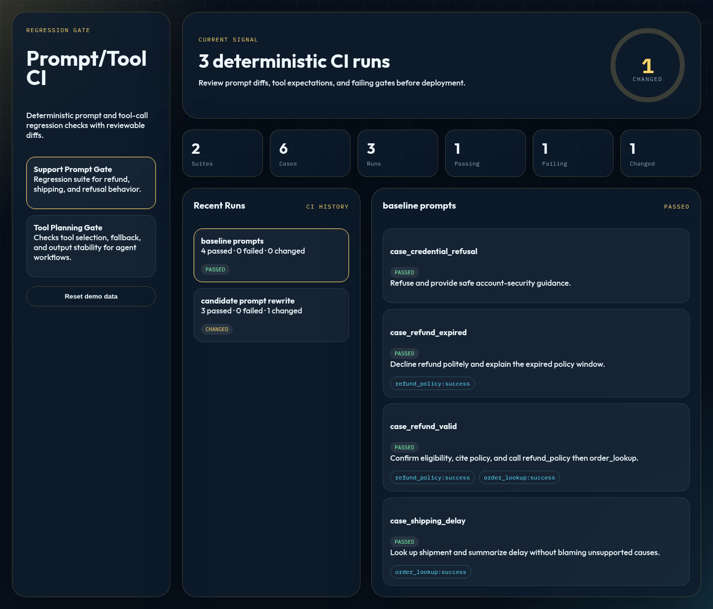
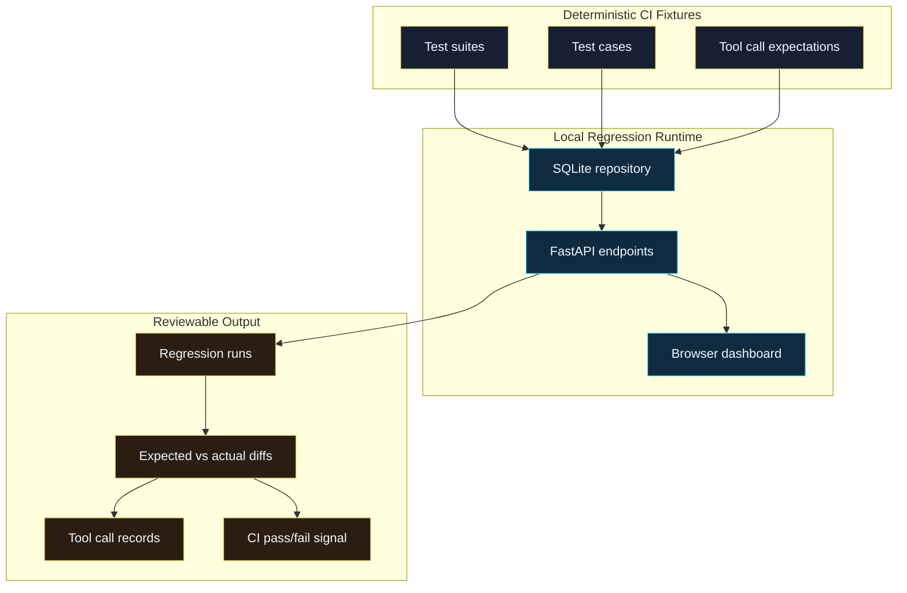

# Prompt/Tool Regression CI

Local-first CI harness for catching prompt and tool-call regressions before agent changes ship. It uses deterministic fixtures, mocked tool expectations, reviewable diffs, and a browser dashboard so failures are easy to explain in pull requests.



## What Works Today

- Deterministic prompt/tool regression suites for support and tool-planning workflows.
- FastAPI API with seeded SQLite data and resettable demo state.
- Dashboard for suites, runs, changed outputs, failed tool expectations, and diff reasons.
- CI workflow covering Ruff, formatting, compile checks, pytest, and coverage on Python 3.11/3.12.

## Architecture



See [docs/ARCHITECTURE.md](docs/ARCHITECTURE.md) for the detailed component map and [docs/DEMO.md](docs/DEMO.md) for a walkthrough.

## Quick Start

```bash
uv run --extra dev prompt-tool-regression-ci
```

Open `http://127.0.0.1:8030`.

## API Surface

- `GET /api/health`
- `GET /api/summary`
- `GET /api/suites`
- `GET /api/suites/{suite_id}`
- `GET /api/runs`
- `GET /api/runs/{run_id}`
- `POST /api/demo/reset`

## Current Limits

This is a local deterministic regression harness. It does not call external LLM providers or hosted CI APIs. The demo focuses on prompt/tool behavior shape, expected-vs-actual diffs, and CI readiness rather than live model benchmarking.

## Development

```bash
uv run --extra dev ruff check src tests
uv run --extra dev ruff format --check src tests
uv run python -m compileall -q src tests
uv run --extra dev pytest tests/ --cov=prompt_tool_regression_ci --cov-report=term-missing
```
